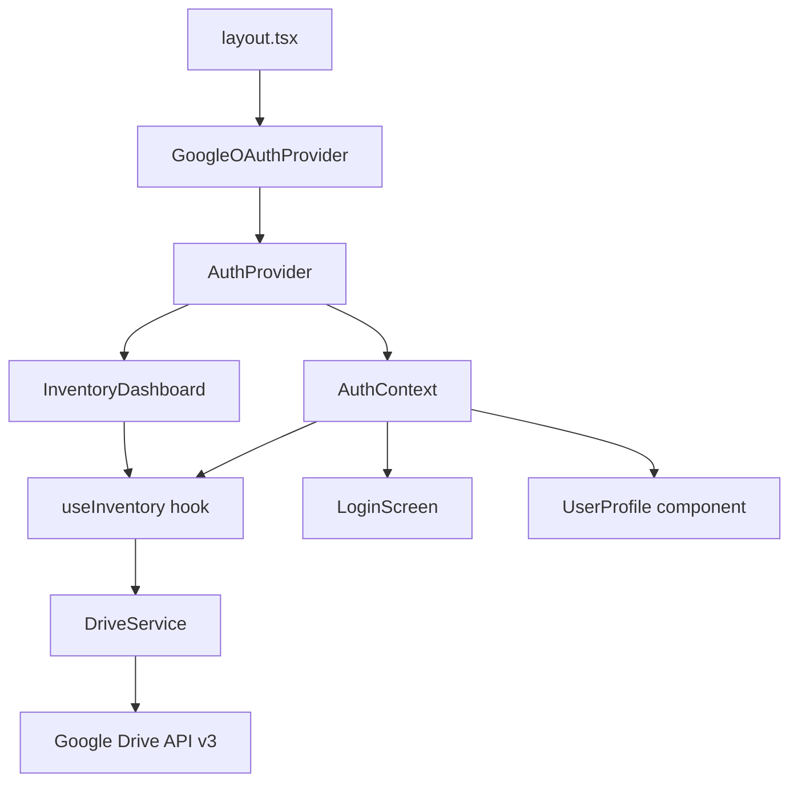
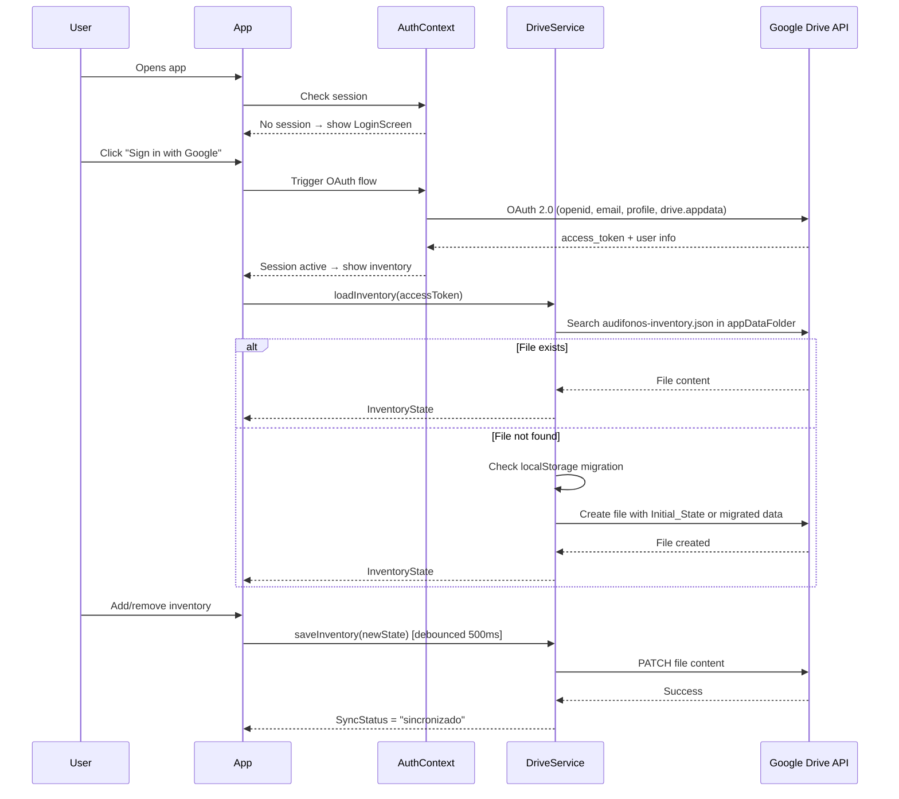

# Design Document

## Feature: google-auth-drive-inventory

---

## Overview

This feature adds Google OAuth 2.0 authentication to the AudífonosPro inventory app and migrates persistent storage from `localStorage` to a JSON file in the user's Google Drive `appDataFolder`. The app is built with Next.js 15, React 19, and TypeScript.

The core change is introducing an `AuthContext` that gates access to the inventory UI, a `DriveService` that replaces `localStorage` reads/writes, and an updated `useInventory` hook that delegates persistence to the Drive service. A one-time migration path handles existing `localStorage` data.

Key design decisions:
- **`@react-oauth/google`** for the Google Sign-In button and token management — it wraps the Google Identity Services (GIS) library and integrates cleanly with React.
- **`appDataFolder`** scope instead of full Drive access — the inventory file is hidden from the user's main Drive, reducing the OAuth consent surface.
- **Debounced writes** (500ms) to avoid hammering the Drive API on rapid state changes, while still meeting the 2-second SLA from requirements.
- **Optimistic UI** — inventory state updates immediately in memory; Drive sync happens asynchronously with visible status feedback.

---

## Architecture



### Data Flow



---

## Components and Interfaces

### New Files

```
src/
  contexts/
    AuthContext.tsx          # Google OAuth state + sign-in/sign-out
  services/
    driveService.ts          # Google Drive API calls
  components/
    LoginScreen.tsx          # Sign-in UI shown when unauthenticated
    SyncIndicator.tsx        # Sync status badge (sincronizado/sincronizando/error)
    UserProfile.tsx          # Avatar + name + sign-out button
docs/
  google-cloud-setup.md
  environment-setup.md
  drive-api-scopes.md
```

### Modified Files

```
src/app/layout.tsx           # Wrap with GoogleOAuthProvider + AuthProvider
src/hooks/useInventory.ts    # Replace localStorage with DriveService calls
src/inventory/components/
  inventory-dashboard.tsx    # Add SyncIndicator + UserProfile
```

### AuthContext Interface

```typescript
interface AuthUser {
  name: string;
  email: string;
  picture: string;
  accessToken: string;
}

interface AuthContextValue {
  user: AuthUser | null;
  isLoading: boolean;
  error: string | null;
  signIn: () => void;
  signOut: () => void;
}
```

### DriveService Interface

```typescript
type SyncStatus = 'sincronizado' | 'sincronizando' | 'error';

interface DriveServiceResult<T> {
  data: T | null;
  error: string | null;
}

// Core functions (not a class — plain async functions)
async function loadInventory(accessToken: string): Promise<DriveServiceResult<InventoryState>>
async function saveInventory(accessToken: string, state: InventoryState): Promise<DriveServiceResult<void>>
```

### Updated useInventory Hook Interface

```typescript
// New parameters
function useInventory(accessToken: string | null): {
  // existing returns...
  inventory: InventoryState;
  isLoaded: boolean;
  syncStatus: SyncStatus;
  lastSyncedAt: Date | null;
  syncError: string | null;
  retrySync: () => void;
  addEntry: (color: ColorType, quantity: number, notes?: string) => void;
  addExit: (color: ColorType, quantity: number, notes?: string) => { success: boolean; error?: string };
  addMultiExit: (items: { color: ColorType; quantity: number }[], notes?: string) => { success: boolean; error?: string };
  resetInventory: () => void;
  getTotalStock: () => number;
  getTotalEntries: () => number;
  getTotalExits: () => number;
}
```

### SyncIndicator Props

```typescript
interface SyncIndicatorProps {
  status: SyncStatus;
  lastSyncedAt: Date | null;
  error: string | null;
  onRetry: () => void;
}
```

---

## Data Models

### InventoryState (unchanged)

```typescript
interface InventoryState {
  products: Record<ColorType, number>;  // { azul: 100, blanco: 100, ... }
  transactions: Transaction[];
}
```

### Inventory File on Drive

The file `audifonos-inventory.json` stored in `appDataFolder` contains a serialized `InventoryState`:

```json
{
  "products": {
    "azul": 100,
    "blanco": 100,
    "verde": 100,
    "rosa": 100,
    "negro": 100
  },
  "transactions": [
    {
      "id": "initial-1",
      "type": "entrada",
      "color": "azul",
      "quantity": 100,
      "date": "2024-01-01T00:00:00.000Z",
      "notes": "Pedido inicial de China"
    }
  ]
}
```

### Initial State (preserved from existing hook)

```typescript
const INITIAL_STATE: InventoryState = {
  products: { azul: 100, blanco: 100, verde: 100, rosa: 100, negro: 100 },
  transactions: [
    { id: 'initial-1', type: 'entrada', color: 'azul', quantity: 100, date: '...', notes: 'Pedido inicial de China' },
    { id: 'initial-2', type: 'entrada', color: 'blanco', quantity: 100, date: '...', notes: 'Pedido inicial de China' },
    { id: 'initial-3', type: 'entrada', color: 'verde', quantity: 100, date: '...', notes: 'Pedido inicial de China' },
    { id: 'initial-4', type: 'entrada', color: 'rosa', quantity: 100, date: '...', notes: 'Pedido inicial de China' },
    { id: 'initial-5', type: 'entrada', color: 'negro', quantity: 100, date: '...', notes: 'Pedido inicial de China' },
  ]
};
```

### Environment Variables

```
NEXT_PUBLIC_GOOGLE_CLIENT_ID=<oauth-client-id>
```

Note: The requirements reference `VITE_GOOGLE_CLIENT_ID` but this is a Next.js app, so the correct prefix is `NEXT_PUBLIC_`.

### Drive API Calls

| Operation | Method | Endpoint |
|-----------|--------|----------|
| Search file | GET | `https://www.googleapis.com/drive/v3/files?spaces=appDataFolder&q=name='audifonos-inventory.json'` |
| Read file | GET | `https://www.googleapis.com/drive/v3/files/{fileId}?alt=media` |
| Create file | POST | `https://www.googleapis.com/upload/drive/v3/files?uploadType=multipart` |
| Update file | PATCH | `https://www.googleapis.com/upload/drive/v3/files/{fileId}?uploadType=media` |

---

## Correctness Properties

*A property is a characteristic or behavior that should hold true across all valid executions of a system — essentially, a formal statement about what the system should do. Properties serve as the bridge between human-readable specifications and machine-verifiable correctness guarantees.*

### Property 1: Auth state drives UI visibility

*For any* authentication state, the inventory UI components SHALL be rendered if and only if a valid user session exists; when no session exists, only the login screen SHALL be rendered.

**Validates: Requirements 1.4, 1.7**

---

### Property 2: Sign-in/sign-out round trip clears auth state

*For any* user who completes a successful sign-in followed by a sign-out, the resulting auth context state SHALL be equivalent to the initial unauthenticated state (user = null, no token in memory).

**Validates: Requirements 1.6**

---

### Property 3: Drive read/write round trip preserves InventoryState

*For any* valid `InventoryState`, serializing it to JSON and writing it to the Drive file, then reading and deserializing that file, SHALL produce a value deeply equal to the original state.

**Validates: Requirements 2.3, 2.4**

---

### Property 4: Invalid data fallback to Initial_State

*For any* string that is not valid JSON, or any JSON object that does not conform to the `InventoryState` schema, attempting to load it as inventory data SHALL result in the `INITIAL_STATE` being used instead, with an error notification shown to the user.

**Validates: Requirements 2.6, 4.4**

---

### Property 5: Reset restores Initial_State

*For any* `InventoryState` (regardless of how many transactions have occurred), calling `resetInventory()` SHALL set the in-memory state to `INITIAL_STATE` and trigger a Drive write with that exact state.

**Validates: Requirements 3.4**

---

### Property 6: Migration uses localStorage data and clears it

*For any* valid `InventoryState` stored in `localStorage` under key `audifonos-inventory-v1`, when no Drive file exists at login, the Drive file SHALL be created with that localStorage state (not `INITIAL_STATE`), and after successful creation the `localStorage` key SHALL be removed.

**Validates: Requirements 4.2, 4.3**

---

### Property 7: Sync indicator reflects all three states

*For any* `SyncStatus` value (`sincronizado`, `sincronizando`, `error`), the `SyncIndicator` component SHALL render a visually distinct representation for each state, and the rendered output SHALL contain the corresponding status label.

**Validates: Requirements 6.1**

---

## Error Handling

### OAuth Errors

| Scenario | Handling |
|----------|----------|
| User cancels OAuth popup | Show descriptive error message, keep sign-in button active |
| OAuth token expired | Prompt re-authentication silently if possible, else show sign-in screen |
| Missing `NEXT_PUBLIC_GOOGLE_CLIENT_ID` | Log clear error to console on app startup; `GoogleOAuthProvider` will fail gracefully |

### Drive API Errors

| Scenario | Handling |
|----------|----------|
| Write fails (network/quota) | Retry up to 3 times with exponential backoff (1s, 2s, 4s); after all retries fail, set `syncStatus = 'error'` and show retry button |
| Read fails on login | Fall back to `INITIAL_STATE`, show toast notification |
| Invalid JSON in Drive file | Fall back to `INITIAL_STATE`, show toast notification |
| 401 Unauthorized | Clear session, redirect to login screen |

### Retry Logic (exponential backoff)

```typescript
async function withRetry<T>(
  fn: () => Promise<T>,
  maxAttempts = 3,
  baseDelayMs = 1000
): Promise<T> {
  for (let attempt = 1; attempt <= maxAttempts; attempt++) {
    try {
      return await fn();
    } catch (err) {
      if (attempt === maxAttempts) throw err;
      await delay(baseDelayMs * Math.pow(2, attempt - 1));
    }
  }
}
```

---

## Testing Strategy

### Dual Testing Approach

Both unit tests and property-based tests are required. Unit tests cover specific examples, integration points, and error conditions. Property-based tests verify universal correctness across all valid inputs.

### Property-Based Testing Library

Use **`fast-check`** for property-based testing (TypeScript-native, works with Vitest/Jest).

```bash
npm install --save-dev fast-check vitest @testing-library/react @testing-library/user-event
```

Each property test MUST run a minimum of **100 iterations** (fast-check default is 100).

Each property test MUST include a comment tag in the format:
`// Feature: google-auth-drive-inventory, Property {N}: {property_text}`

### Property Tests

Each correctness property is implemented by a single property-based test:

**Property 1** — Auth state drives UI visibility
```
// Feature: google-auth-drive-inventory, Property 1: Auth state drives UI visibility
// For any auth state, inventory UI renders iff session exists
fc.property(fc.option(arbitraryAuthUser()), (user) => { ... })
```

**Property 2** — Sign-in/sign-out round trip
```
// Feature: google-auth-drive-inventory, Property 2: Sign-in/sign-out round trip clears auth state
// For any user, signIn then signOut results in null user state
fc.property(arbitraryAuthUser(), async (user) => { ... })
```

**Property 3** — Drive read/write round trip
```
// Feature: google-auth-drive-inventory, Property 3: Drive read/write round trip preserves InventoryState
// For any InventoryState, serialize → write → read → deserialize === original
fc.property(arbitraryInventoryState(), async (state) => { ... })
```

**Property 4** — Invalid data fallback
```
// Feature: google-auth-drive-inventory, Property 4: Invalid data fallback to Initial_State
// For any invalid JSON or malformed object, loadInventory returns INITIAL_STATE
fc.property(fc.oneof(fc.string(), arbitraryMalformedObject()), async (bad) => { ... })
```

**Property 5** — Reset restores Initial_State
```
// Feature: google-auth-drive-inventory, Property 5: Reset restores Initial_State
// For any InventoryState, resetInventory() produces INITIAL_STATE
fc.property(arbitraryInventoryState(), async (state) => { ... })
```

**Property 6** — Migration uses localStorage data and clears it
```
// Feature: google-auth-drive-inventory, Property 6: Migration uses localStorage data and clears it
// For any valid InventoryState in localStorage, migration creates Drive file with that state and removes localStorage key
fc.property(arbitraryInventoryState(), async (state) => { ... })
```

**Property 7** — Sync indicator reflects all three states
```
// Feature: google-auth-drive-inventory, Property 7: Sync indicator reflects all three states
// For any SyncStatus, SyncIndicator renders the correct label
fc.property(fc.constantFrom('sincronizado', 'sincronizando', 'error'), (status) => { ... })
```

### Unit Tests

Unit tests focus on specific examples and edge cases not covered by property tests:

- **AuthContext**: Sign-in button renders when unauthenticated; user name/photo renders when authenticated; error message shown on OAuth failure
- **DriveService**: Correct API endpoints called for search/create/read/update; retry called exactly 3 times on repeated failure; 401 response clears session
- **useInventory**: `addExit` rejects when quantity exceeds stock; `addMultiExit` validates all items before mutating state
- **Migration**: When Drive file missing and localStorage has valid data, migration path is taken; when localStorage has invalid JSON, `INITIAL_STATE` is used
- **SyncIndicator**: Shows timestamp after successful save; shows retry button in error state; retry button click calls `retrySync`
- **Config validation**: Missing `NEXT_PUBLIC_GOOGLE_CLIENT_ID` logs error to console
