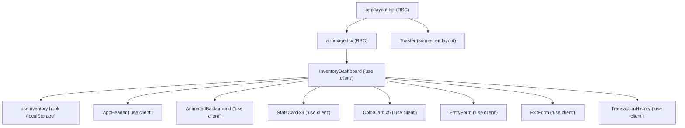

# Documento de Diseño Técnico

## Migración Vite → Next.js 15: AudífonosPro

---

## Visión General

Este documento describe el diseño técnico para migrar la aplicación **AudífonosPro** desde una SPA con Vite 7 + React 19 hacia Next.js 15 con App Router. La app gestiona inventario de audífonos por color (azul, blanco, verde, rosa, negro) con persistencia en `localStorage`.

La migración no introduce backend ni base de datos. Todo el estado sigue siendo cliente-only vía `localStorage`. El objetivo principal es adoptar la arquitectura de Next.js 15 correctamente (RSC boundaries, App Router, `next/font`) y reorganizar el código bajo **Screaming Architecture** (organización por dominio).

### Decisiones de diseño clave

- **Sin SSR de datos**: No hay datos que hidratar desde el servidor. `localStorage` es exclusivamente del cliente, por lo que el árbol de componentes interactivos arranca desde `InventoryDashboard` con `'use client'`.
- **RSC como shell**: `app/layout.tsx` y `app/page.tsx` son RSC puros que no pasan funciones ni estado a sus hijos — solo renderizan el árbol.
- **Screaming Architecture**: Las carpetas reflejan dominios de negocio (`inventory/`, `shared/`), no tipos de archivo (`components/`, `hooks/`).
- **pnpm**: Gestor de paquetes para todas las operaciones de instalación y scripts.

---

## Arquitectura

### Diagrama de estructura de archivos

```
src/
├── app/                              # Next.js App Router (rutas)
│   ├── layout.tsx                    # RSC — RootLayout: fuentes, html, Toaster
│   └── page.tsx                      # RSC — shell que renderiza <InventoryDashboard />
│
├── inventory/                        # Dominio de inventario
│   ├── types.ts                      # ColorType, Transaction, InventoryState, COLOR_CONFIG
│   ├── hooks/
│   │   └── use-inventory.ts          # 'use client' — hook con localStorage
│   └── components/
│       ├── inventory-dashboard.tsx   # 'use client' — orquestador principal
│       ├── color-card.tsx            # 'use client' — framer-motion
│       ├── entry-form.tsx            # 'use client' — formulario entrada
│       ├── exit-form.tsx             # 'use client' — formulario salida multi
│       ├── stats-card.tsx            # 'use client' — framer-motion
│       └── transaction-history.tsx   # 'use client' — filtro con useState
│
└── shared/
    └── components/
        ├── animated-background.tsx   # 'use client' — orbs framer-motion
        └── app-header.tsx            # 'use client' — botón reset con confirm()
```

### Diagrama de flujo RSC → Client



### Frontera RSC / Client Component

| Archivo | Tipo | Razón |
|---|---|---|
| `app/layout.tsx` | RSC puro | Solo metadatos, fuentes, estructura HTML |
| `app/page.tsx` | RSC puro | Solo renderiza `<InventoryDashboard />` sin props |
| `inventory/components/inventory-dashboard.tsx` | `'use client'` | Usa `useInventory`, `useState`, `toast` |
| `inventory/components/color-card.tsx` | `'use client'` | `motion.div`, `whileHover` |
| `inventory/components/entry-form.tsx` | `'use client'` | `useState`, event handlers |
| `inventory/components/exit-form.tsx` | `'use client'` | `useState`, event handlers |
| `inventory/components/stats-card.tsx` | `'use client'` | `motion.div`, `whileHover` |
| `inventory/components/transaction-history.tsx` | `'use client'` | `useState` para filtro |
| `inventory/hooks/use-inventory.ts` | `'use client'` | `localStorage`, `useState`, `useEffect` |
| `shared/components/animated-background.tsx` | `'use client'` | `motion.div` con animaciones continuas |
| `shared/components/app-header.tsx` | `'use client'` | `confirm()` del browser |

**Regla crítica**: `app/page.tsx` no pasa ninguna prop a `InventoryDashboard`. El componente cliente se monta sin datos del servidor y carga su estado desde `localStorage` en el `useEffect` inicial.

---

## Componentes e Interfaces

### `app/layout.tsx` (RSC)

```tsx
import type { Metadata } from 'next'
import { Inter } from 'next/font/google'
import { Toaster } from 'sonner'
import './globals.css'

const inter = Inter({ subsets: ['latin'], variable: '--font-inter' })

export const metadata: Metadata = {
  title: 'AudífonosPro — Gestión de Inventario',
  description: 'Sistema de gestión de inventario de audífonos por color',
}

export default function RootLayout({ children }: { children: React.ReactNode }) {
  return (
    <html lang="es" className={`${inter.variable} dark`}>
      <body className="bg-gray-950 antialiased">
        {children}
        <Toaster
          position="top-right"
          theme="dark"
          toastOptions={{
            style: {
              background: 'rgba(17, 24, 39, 0.95)',
              border: '1px solid rgba(255, 255, 255, 0.1)',
              backdropFilter: 'blur(10px)',
            },
          }}
        />
      </body>
    </html>
  )
}
```

**Decisión**: `Toaster` se coloca en el layout (RSC) porque sonner no requiere `'use client'` para el componente `<Toaster>` en sí — solo para llamar a `toast()`. El layout puede renderizarlo como nodo estático.

### `app/page.tsx` (RSC)

```tsx
import { InventoryDashboard } from '@/inventory/components/inventory-dashboard'

export default function Page() {
  return <InventoryDashboard />
}
```

Sin metadatos adicionales aquí (están en el layout). Sin props. Sin lógica.

### `inventory/hooks/use-inventory.ts`

Migración directa de `src/hooks/useInventory.ts`. Cambios:
- Renombrado a `use-inventory.ts` (kebab-case, convención Next.js)
- Directiva `'use client'` en la primera línea
- Importaciones desde `@/inventory/types`

Interfaz pública sin cambios:

```ts
interface UseInventoryReturn {
  inventory: InventoryState
  isLoaded: boolean
  addEntry: (color: ColorType, quantity: number, notes?: string) => void
  addExit: (color: ColorType, quantity: number, notes?: string) => { success: boolean; error?: string }
  addMultiExit: (items: { color: ColorType; quantity: number }[], notes?: string) => { success: boolean; error?: string }
  resetInventory: () => void
  getTotalStock: () => number
  getTotalEntries: () => number
  getTotalExits: () => number
}
```

**Nota sobre `resetInventory`**: La llamada a `confirm()` se mueve a `AppHeader` para mantener el hook libre de efectos secundarios de UI. El hook expone `resetInventory()` sin confirmación; el componente que lo llama es responsable de pedir confirmación.

### `inventory/components/inventory-dashboard.tsx`

Orquestador principal. Equivalente al `App.tsx` actual pero sin el layout HTML global (que ahora está en `layout.tsx`).

Responsabilidades:
- Llama a `useInventory()`
- Maneja `handleEntry` y `handleExit` con `toast`
- Renderiza el spinner de carga cuando `!isLoaded`
- Compone `AnimatedBackground`, `AppHeader`, stats, grid de colores, formularios e historial

### `shared/components/app-header.tsx`

Extrae el header del `App.tsx` actual. Recibe `onReset: () => void` como prop y llama a `confirm()` antes de ejecutarlo.

```tsx
interface AppHeaderProps {
  onReset: () => void
}
```

### `shared/components/animated-background.tsx`

Extrae los tres orbs animados y el grid pattern del `App.tsx` actual. Sin props.

### Componentes de inventario

Los componentes `ColorCard`, `EntryForm`, `ExitForm`, `StatsCard` y `TransactionHistory` son migraciones directas desde `src/components/`. Cambios:
- Renombrados a kebab-case
- Directiva `'use client'` en primera línea
- Importaciones actualizadas a `@/inventory/types`

---

## Modelos de Datos

### Tipos del dominio (`src/inventory/types.ts`)

```ts
export type ColorType = 'azul' | 'blanco' | 'verde' | 'rosa' | 'negro'

export interface Transaction {
  id: string
  type: 'entrada' | 'salida'
  color: ColorType
  quantity: number
  date: string       // ISO 8601
  notes?: string
}

export interface InventoryState {
  products: Record<ColorType, number>
  transactions: Transaction[]
}

export const COLOR_CONFIG: Record<ColorType, {
  name: string
  gradient: string
  hex: string
  glow: string
}> = {
  azul:   { name: 'Azul',   gradient: 'from-blue-500 to-cyan-400',    hex: '#3B82F6', glow: 'shadow-blue-500/50'    },
  blanco: { name: 'Blanco', gradient: 'from-slate-100 to-white',      hex: '#F8FAFC', glow: 'shadow-white/50'       },
  verde:  { name: 'Verde',  gradient: 'from-emerald-500 to-green-400', hex: '#10B981', glow: 'shadow-emerald-500/50' },
  rosa:   { name: 'Rosa',   gradient: 'from-pink-500 to-rose-400',    hex: '#EC4899', glow: 'shadow-pink-500/50'    },
  negro:  { name: 'Negro',  gradient: 'from-gray-800 to-black',       hex: '#1F2937', glow: 'shadow-gray-500/50'    },
}
```

### Estado en localStorage

```
Clave: 'audifonos-inventory-v1'
Valor: JSON.stringify(InventoryState)
```

Estado inicial (cuando no hay datos previos):
```ts
{
  products: { azul: 100, blanco: 100, verde: 100, rosa: 100, negro: 100 },
  transactions: [/* 5 transacciones iniciales de entrada */]
}
```

### Configuración de Next.js (`next.config.ts`)

```ts
import type { NextConfig } from 'next'

const nextConfig: NextConfig = {
  // Sin configuración especial requerida para esta app
}

export default nextConfig
```

### Configuración de TypeScript (`tsconfig.json`)

El alias `@/` debe apuntar a `./src`:

```json
{
  "compilerOptions": {
    "paths": {
      "@/*": ["./src/*"]
    }
  }
}
```

### Configuración de Tailwind (`tailwind.config.ts`)

```ts
export default {
  darkMode: 'class',
  content: ['./src/**/*.{ts,tsx}'],
  // ...
}
```

---

## Propiedades de Corrección

*Una propiedad es una característica o comportamiento que debe mantenerse verdadero en todas las ejecuciones válidas del sistema — esencialmente, una declaración formal sobre lo que el sistema debe hacer. Las propiedades sirven como puente entre las especificaciones legibles por humanos y las garantías de corrección verificables por máquinas.*

Dado que el usuario ha solicitado omitir los tests, las siguientes propiedades se documentan como especificación formal del comportamiento esperado del sistema, sin implementación de tests automatizados.

### Propiedad 1: Completitud de COLOR_CONFIG

*Para todo* `ColorType` en `{ azul, blanco, verde, rosa, negro }`, `COLOR_CONFIG[color]` debe contener los campos `name` (string), `gradient` (string), `hex` (string) y `glow` (string), todos con valores no vacíos.

**Valida: Requisito 3.3**

### Propiedad 2: addEntry incrementa el stock exactamente

*Para cualquier* estado de inventario válido, color `c` y cantidad `q > 0`, después de llamar a `addEntry(c, q)`, el stock de `c` debe ser exactamente `inventario_previo.products[c] + q`, y el stock de todos los demás colores debe permanecer sin cambios.

**Valida: Requisito 4.3**

### Propiedad 3: Persistencia en localStorage (round trip)

*Para cualquier* secuencia de operaciones válidas sobre el inventario, el estado serializado en `localStorage['audifonos-inventory-v1']` debe ser deserializable y producir un `InventoryState` equivalente al estado en memoria.

**Valida: Requisito 4.1**

### Propiedad 4: addMultiExit rechaza stock insuficiente

*Para cualquier* lista de items donde al menos un item tiene `quantity > inventory.products[color]`, `addMultiExit` debe retornar `{ success: false, error: string }` y el estado del inventario debe permanecer sin modificaciones.

**Valida: Requisitos 4.4, 4.5**

### Propiedad 5: Reset restaura el estado inicial (round trip)

*Para cualquier* estado de inventario (con cualquier número de transacciones y cantidades), después de llamar a `resetInventory()`, el estado debe ser idéntico al estado inicial: 100 unidades por color y las 5 transacciones iniciales.

**Valida: Requisito 4.6**

### Propiedad 6: Consistencia de funciones derivadas

*Para cualquier* estado de inventario válido:
- `getTotalStock()` debe ser igual a la suma de `Object.values(inventory.products)`
- `getTotalEntries()` debe ser igual a la suma de `quantity` de todas las transacciones con `type === 'entrada'`
- `getTotalExits()` debe ser igual a la suma de `quantity` de todas las transacciones con `type === 'salida'`

**Valida: Requisito 4.7**

---

## Manejo de Errores

### Hidratación (Hydration Mismatch)

El riesgo principal de esta migración es un error de hidratación causado por `localStorage`. El patrón para evitarlo:

```tsx
// use-inventory.ts
const [isLoaded, setIsLoaded] = useState(false)

useEffect(() => {
  // Solo se ejecuta en el cliente
  const stored = localStorage.getItem(STORAGE_KEY)
  if (stored) {
    try {
      setInventory(JSON.parse(stored))
    } catch {
      // JSON inválido: usar estado inicial
    }
  }
  setIsLoaded(true)
}, [])
```

```tsx
// inventory-dashboard.tsx
if (!isLoaded) {
  return <LoadingSpinner />  // Mismo markup en servidor y cliente
}
```

El servidor renderiza el spinner. El cliente también renderiza el spinner inicialmente. Después del primer `useEffect`, el cliente carga `localStorage` y re-renderiza con los datos reales. No hay mismatch.

### Errores de stock insuficiente

`addMultiExit` valida el stock de todos los items antes de modificar el estado. Si alguno falla, retorna `{ success: false, error }` sin efectos secundarios. `InventoryDashboard` muestra el error via `toast.error`.

### JSON inválido en localStorage

Si `localStorage` contiene datos corruptos, el `try/catch` en `useInventory` descarta los datos y usa el estado inicial. El usuario pierde el historial pero la app no crashea.

### Errores de importación circular

La estructura de dominios previene importaciones circulares:
- `app/` importa de `inventory/` y `shared/`
- `inventory/` importa de `inventory/types` y `shared/`
- `shared/` no importa de `inventory/` ni de `app/`

---

## Estrategia de Testing

El usuario ha solicitado explícitamente omitir los tests en esta migración. Las propiedades de corrección documentadas en la sección anterior sirven como especificación formal para validación manual o futura implementación de tests.

Si en el futuro se decide agregar tests, la recomendación es:

**Tests unitarios** (con Vitest):
- Verificar las propiedades 1, 2, 4, 5 y 6 sobre el hook `useInventory` con mocks de `localStorage`
- Verificar la estructura de `COLOR_CONFIG` (propiedad 1)

**Tests de propiedad** (con fast-check):
- Propiedad 2: generar colores y cantidades aleatorias, verificar incremento exacto
- Propiedad 4: generar items con cantidades que superen el stock, verificar rechazo
- Propiedad 6: generar estados de inventario aleatorios, verificar consistencia de derivados

**Configuración recomendada si se implementan**:
- Librería PBT: `fast-check` (compatible con Vitest)
- Mínimo 100 iteraciones por propiedad
- Tag format: `Feature: vite-to-nextjs-migration, Property {N}: {texto}`
